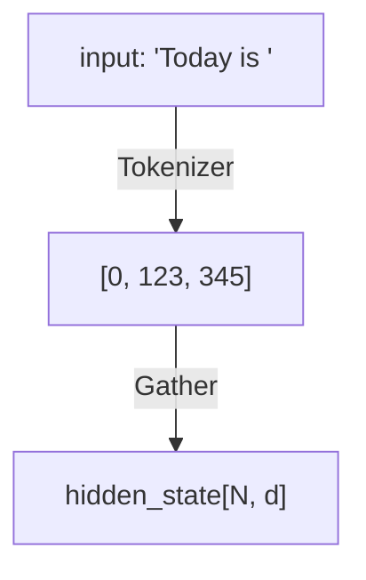
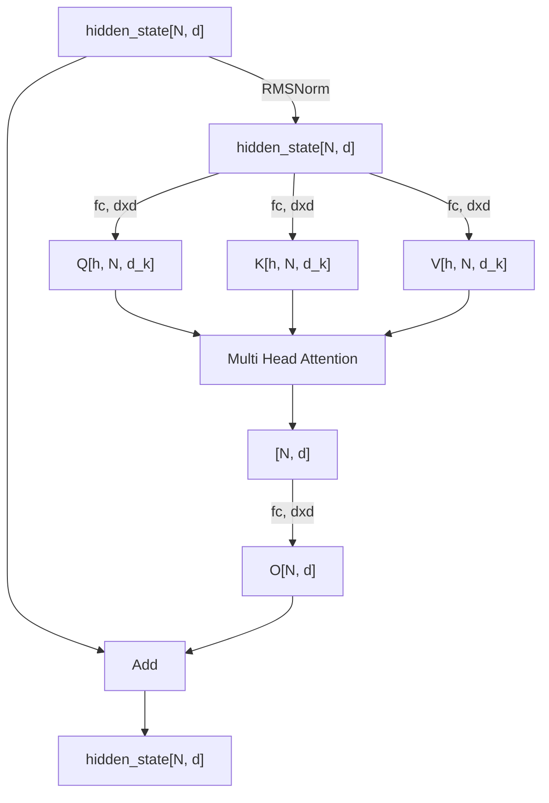
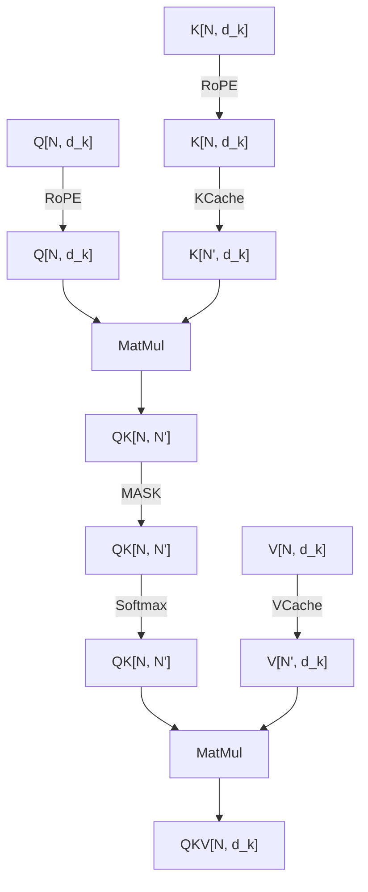
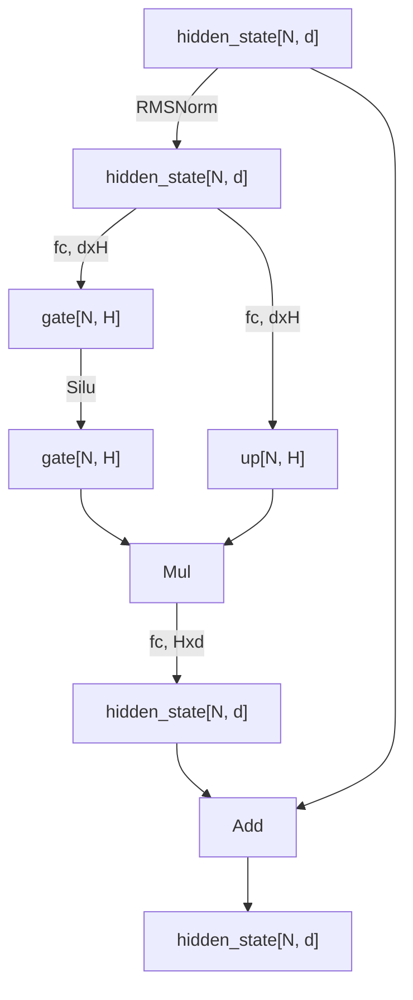
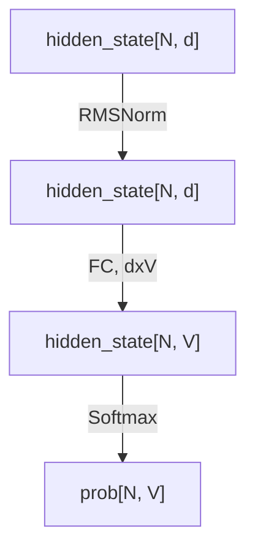

只看了 llama2，想来别的模型也差不太多。
所谓不本质学习，其实就是只关注具体计算，不去研究啥原理之类的本质问题；大概目标是看完了能用喜欢的语言实现一个自己的 [llama.cpp](https://github.com/ggerganov/llama.cpp)。
Transformer 的 [参考 blog](https://jiajiewu.gitee.io/post/tech/attention/att_intro/)

## 整体原理
**模型的功能**是输入一句话转换成的 $n$ 个 token 数组 $t_0, t_1, ..., t_{n-1}$，输出预测的 $n$ 个 token $t_1,t_2,...,t_n$。模型的一个特点是它有记忆，所谓记忆即通过缓存部分中间输出，后续模型运行就不需要重复输入了——即预测好 $n$ 个 token 后，可以在模型里输入新得到的 $t_n$，输出 $t_{n+1}$。
因此实际计算分成两步，第一步姑且叫 *fill*，第二步叫 *generate*，实际是同一个模型。在 *fill* 的时候，输入是 prompt 包括用户输入的 $n$ 个 token，得到第 $n+1$ 个 token $t_{n}$，并把相关记忆缓存住。在 *generate* 的时候，就是一个自回归的操作，输入之前得到的 token $t_n$，输出新的预测 $t_{n+1}$。这样就能不断输出新的 token，就像模型在说话一样，直到输出代表结束的 token。

1.  _fill_ 的时候
$$ t_1, t_2,...,t_n = predict(t_0, t_1, ..., t_{n-1})$$
2. _generate_ 的时候
$$t_{n+1}=predict(t_n)$$
其实有了 _generate_ 的递推了，第一步 _fill_ 是可有可无的；但是 _fill_ 的计算访存比更高，可以更充分利用算力，所以要有 *fill* 这步。

> token: 单词转换成的无符号数表示
> prompt: 提示词，包括系统 prompt 和用户给的 prompt
{: .notice}

## 配置参数

| 参数     | 示例值   | config.json         | 含义                                     |
| -------- | ----- | ------------------- | -------------------------------------- |
| $d$      | 4096  | hidden_size         | 隐含层维数                                  |
| $H$      | 11008 | intermediate_size   | FFN 中间层维数，具体是 $d\times\frac83$ 对齐到 128 |
| $h$      | 32    | num_attention_heads | 多头注意力的头数                               |
| $l$      | 32    | num_hidden_layers   | 隐含层层数                                  |
| $h_{kv}$ | 32    | num_key_value_heads | 多头注意力 KV 的头数（GHA 的时候与 $h$ 不同）          |
| $V$      | 32000 | vocab_size          | 词表长度                                   |

每个隐含层的参数量大约是 $4\frac{h_{kv}}{h}d^2+3Hd+2d$，输入输出的 token embed 矩阵大小都是 $Vd$。所以一个大模型整体的参数量大概是 $(4\frac{h_{kv}}{h}d^2+3Hd+2d)l+2Vd$。

## 具体计算
输入是 `N` 个 token。

### tokenizer
分词，从大小是 `(V, d)` 的 embeding 矩阵里 gather 对应的词向量表示，得到的结果形状是 `(N, d)`。



### layer
就是 `Transformer` 里的一个 `DecoderLayer`。具体组成是两部分，`SelfAttention` 和 `FFN`（FeedFrowardNetwork，也叫 MLP）。
`SelfAttention` 的操作就是经典的 `Attention is all you need` :

$$Attention(\mathbf{Q,K,V})=Softmax(\frac{\mathbf{QK}^T}{\sqrt{d_k}})\mathbf{V}$$

这里 $d_k=\frac{d}{h}$ 是多头注意力里一个头的隐含层维数。
输入先做 `RMSNorm`，然后经过 `Linear` （实际就是 `FC`）生成 $\mathbf{QKV}$ 。其中 $\mathbf{KV}$ 需要做相对位置编码(RoPE)，$\mathbf{QK}^T$ 的结果还要加上一个掩码，以表示输入 $N$ 个 token 是有先后顺序的。结果再做一次 `Linear`，与输入相加（残差块），就是 `SelfAttention` 的全部操作了。

$$\mathbf{X}=RMSNorm(\mathbf{X}_{in})$$

$$\mathbf{Q}_i=XW_{Qi}\quad W_{Qi}\in\mathbb{R}^{d\times d_k}$$

$$\mathbf{K}_i=XW_{Ki}\quad W_{Ki}\in\mathbb{R}^{d\times d_k}$$

$$\mathbf{V}_i=XW_{Vi}\quad W_{Vi}\in\mathbb{R}^{d\times d_k}$$

$$\mathbf{O}_i=Softmax(\operatorname{MASK}(\frac{\mathbf{Q}\operatorname{RoPE}(\mathbf{K}^T)}{\sqrt{d_k}})\operatorname{RoPE}(\mathbf{V})$$

$$\mathbf{O}=concat(\mathbf{O}_i)\quad \mathbf{O}\in\mathbb{R}^{N\times d}$$

$$res=\mathbf{X}_{in}+\operatorname{concat}(\mathbf{O}_i)W_O$$

整体计算流图如下



多头注意力中的一个头的计算流图是



`FFN` 的部分也很简单，就是一个残差块，里面是三个 `Linear` 操作。数学上是这样的

$$
X' = RMSNorm(X)
$$

$$
Y = X + (silu(X'W_{gate})\otimes(X'W_{up}))W_{down}
$$

其中 $W_{gate},W_{up}\in\mathbb{R}^{d\times H}\quad W_{down}\in\mathbb{R}^{H\times d}$



#### RMSNorm
全名叫 `RootMeanSquare Norm`，就是认为输入 $\mathbf{X}$ 的均值为 $0$ 的普通 `LayerNorm`

$$
\bar X=\frac{\mathbf{X}}{\sqrt{\frac1n\sum x_i^2}}\times\mathbf{\alpha}+\beta
$$

里头 $\alpha$ 和 $\beta$ 是可训练的，不过 `llama2` 里 $\beta$ 是 $0$ 。

#### RoPE
全名叫 `Rotray Position Embeding` 旋转位置编码，[十分钟读懂旋转编码（RoPE）](https://www.zhihu.com/tardis/zm/art/647109286?source_id=1003)

$$
f(x_m,m)=\mathbf{R}^d_{\Theta,m}\mathbf{x}_m
$$

这里的 $\mathbf{R}^d_{\Theta, m}$ 是这样的矩阵

$$
\mathbf{R}^d_{\Theta, m}=
\begin{pmatrix}
\cos m\theta_0&-\sin m\theta_0&0&0&\cdots&0&0\\
\sin m\theta_0&\cos m\theta_0&0&0&\cdots&0&0\\
0&0&\cos m\theta_1&-\sin m\theta_1&\cdots&0&0\\
0&0&\sin m\theta_1&\cos m\theta_1&\cdots&0&0\\
\vdots&\vdots&\vdots&\vdots&\ddots&\vdots&\vdots\\
0&0&0&0&\cdots&\cos m\theta_{d_k/2-1}&-\sin m\theta_{d_k/2-1}\\
0&0&0&0&\cdots&\sin m\theta_{d_k/2-1}&\cos m\theta_{d_k/2-1}
\end{pmatrix}
$$

$$
\Theta=\left\{\theta_i=10000^{-2(i-1)/d},i\in[1,2,...,d/2]\right\}
$$

其实就是 $d_k/2$ 个旋转矩阵凑一起了。这里的 $m$ 指的是当前 `token` 的序号，比如 0，1，2，3 等等；在 _generate_ 过程中这个序号也是逐渐增加的。
根据 $\mathbf{R}^d_{\Theta, m}$ 的稀疏性，实际计算可以按

$$
f(x_m,m)=
\begin{pmatrix}x_0\\x_1\\x_2\\x_3\\\vdots\\x_{d_k-2}\\x_{d_k-1}\end{pmatrix}
\otimes
\begin{pmatrix}\cos m\theta_0\\\cos m\theta_0\\\cos m\theta_1\\\cos m\theta_1\\\vdots\\\cos m\theta_{d_k/2-1}\\\cos m\theta_{d_k/2-1}\end{pmatrix}+
\begin{pmatrix}-x_1\\x_0\\-x_3\\x_2\\\vdots\\-x_{d_k-1}\\x_{d_k-2}\end{pmatrix}
\otimes
\begin{pmatrix}\sin m\theta_0\\\sin m\theta_0\\\sin m\theta_1\\\sin m\theta_1\\\vdots\\\sin m\theta_{d_k/2-1}\\\sin m\theta_{d_k/2-1}\end{pmatrix}
$$

> 在实际计算中，输出 $Q$ $K$ 的 `Linear` 操作已经重排了输出结果的顺序，所以在实际计算中，并不是 $x_0\cos m\theta_0 - x_1\sin m\theta_0$，而是 $x_0\cos m\theta_0 - x_{d_k/2}\sin m\theta_0$
{: .warning}

所以实际计算是这样的

```python
y[..., :dk//2] = x[..., :dk//2] * cos_param - x[..., dk//2:] * sin_param
y[..., dk//2:] = x[..., dk//2:] * cos_param + x[..., :dk//2] * sin_param
```

#### KV-Cache
在多头注意力的地方，$\mathbf{KV}$ 的输入都有一步 `K-cache` 和 `V-cache` 的操作，这实际上就是大模型所谓『记忆』的地方，不管是 _fill_ 还是 _generate_ 环节，中间 `Linear` 得到的 $\mathbf{KV}$ 都会缓存到一个地方，然后继续计算的时候是和之前缓存的 $\mathbf{KV}$ 进行 `Concat` 之后做的。这里的 `N'` 其实就是 `N+lastN`，`lastN` 是已经处理的 `token` 总数。
因为 `KV-cache` 的存在，随着模型处理的总 `token` 数增长，cache 需要的空间也是线性增长的，同时这部分计算量是 $2NN\'d$ 也是线性增长的，实际上计算访存比是 $1$。这也是大模型优化的一个比较关键的节点吧。

#### Mask
Mask 的功能是帮助模型了解 token 的时间先后关系，所以实际上只在 $N\ne1$ 即 _fill_ 的时候有用。Mask 矩阵是一个左下角包括对角线都是 $1$ 的矩阵，含义就是后一个 token 知道它自己和之前的 token 的信息，不知道它之后的 token 的信息。

$$
MASK=\begin{pmatrix}
1&0&0&\cdots&0\\
1&1&0&\cdots&0\\
\vdots&\vdots&\vdots&\ddots&\vdots\\
1&1&1&\cdots&1
\end{pmatrix}
$$

#### Softmax
功能是把一个向量映射成和为 $1$ 的类似概率密度分布的形式。

$$
Softmax(x)=\frac{ {e}^{x_i}}{\sum{e^{x_i}}}
$$

在实际操作中，会使用更加数值稳定的计算方法

$$
Softmax(x)=\frac{ {e}^{x_i-x_{max}}}{\sum{e^{x_i-x_{max}}}}
$$


### post
后处理有三步：
1. 第一步是 `(N, d)` 的隐含层在 $d$ 维度上做 `RMSNorm`；
2. 第二步是乘一个 `(d, V)` 维度的矩阵，最后得到的是 $N$ 个维度数是 $V$ 的向量；
3. 第三步是对输出计算 $Softmax$ ，得到的就是 $V$ 个维度就是概率密度。



### token generate
概率密度有了，实际上就直接根据概率随机得到一个 token 值就可以了。为了输出的稳定性、计算效率等等因素，还有一些后处理方式：
1. **topK**，典型值 `20`。只取概率最高的 $k$ 个概率，然后重新归一化进行随机
2. **topP**，典型值 `0.9`。将概率从高到低排序，只在前 $p$ 概率里随机，避免随机到小概率事件，导致输出前言不搭后语的。
3. **temperature**，典型值 `0.9`。其实是在上一步的 $Softmax$ 之前做的，就是对结果做一个除法，把值放大一点，这样 $Softmax$ 之后的概率会更集中，也就是文本生成更连续。
